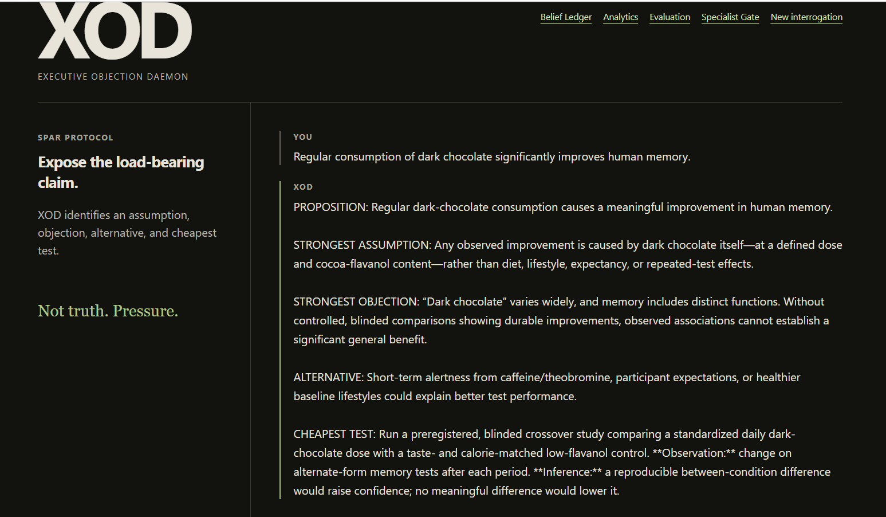
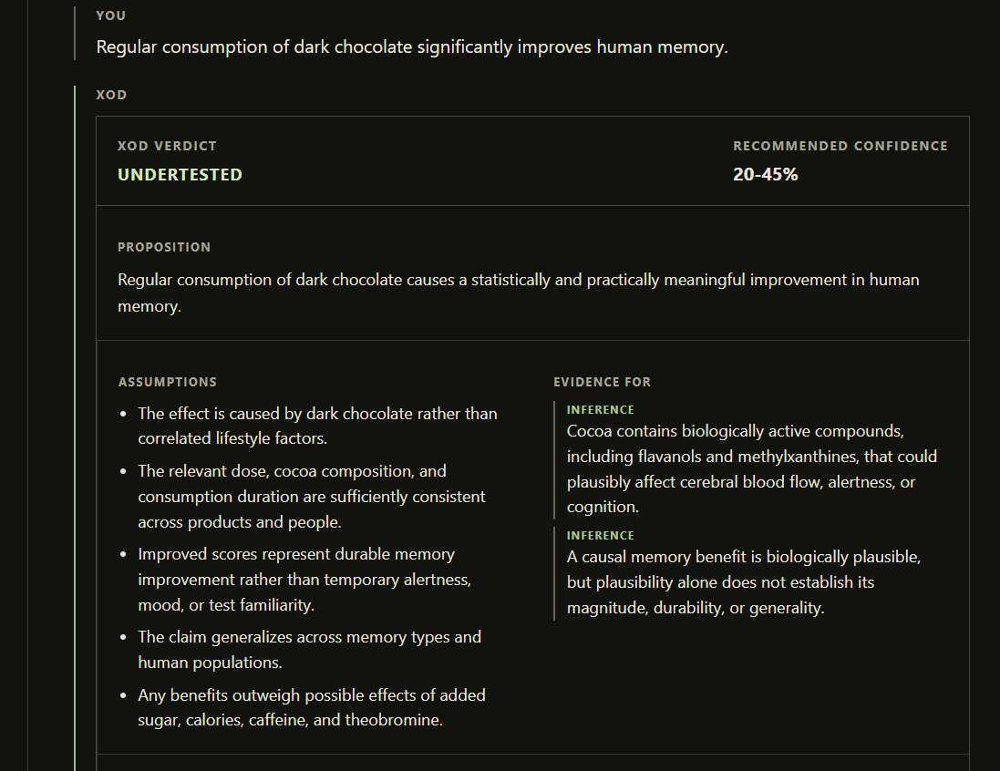
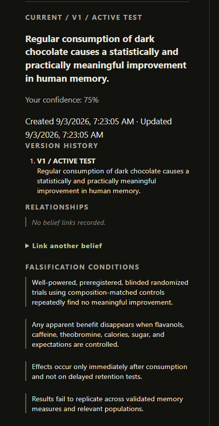
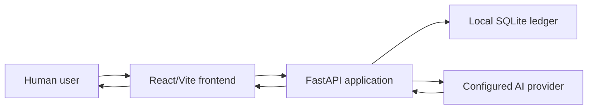

# XOD — Executive Objection Daemon

XOD is a working local prototype for structured, adversarial reasoning. It helps a user examine a proposition through competing objections, explicit assumptions, evidence, predictions, and a versioned belief ledger. It is a decision-support tool, not an authority on truth.

## Why XOD exists

Many AI-assisted workflows make it easy to generate a plausible answer and hard to record why that answer should be trusted, challenged, or revised. XOD explores a narrower question: **what would need to be true for this proposition to be wrong, and what evidence could change the current view?**

The prototype is designed to make reasoning artifacts inspectable and to preserve human judgment at the decision boundary.

## What exists today

- A local Vite/React frontend and FastAPI backend backed by local SQLite.
- SPAR conversations and a Tribunal workflow for structured objections.
- A persistent, versioned Belief Ledger with user-recorded confidence, evidence, predictions, and falsification conditions.
- Explicit, manually recorded belief relationships and bounded relationship traversal.
- Descriptive local analytics, an internal nine-case evaluation suite, and voluntary failure reporting.
- Provider-failure diagnostics with category, unique error ID, retryability, and privacy-minimal operational metadata.
- Specialist-readiness metadata and a gate for future specialist work. **Specialist-agent execution does not exist.**

## What does not exist

This repository is not production-ready. It does not currently provide graph visualization, autonomous confidence changes, external benchmark validation, production deployment, or paying-user validation. It does not connect to external literature systems by default.

XOD cannot guarantee research integrity, factual correctness, safe use, or trustworthy AI. It is a local prototype whose outputs require human review in consequential settings.

## Example reasoning flow

1. A user records a claim and current confidence.
2. XOD generates or records objections, assumptions, evidence, and predictions.
3. The user adds new or contradictory information and records a revised belief version.
4. The user decides what to accept, investigate, defer, or reject.

See [examples/sample_evaluation.md](examples/sample_evaluation.md) for a clearly labelled synthetic demonstration.

## Prototype Walkthrough

Screenshots show a synthetic demonstration of the current local prototype. They are not benchmark results or scientific validation.

### 1. SPAR: Exposing the Load-Bearing Claim



A synthetic proposition is decomposed into its strongest assumption, strongest objection, alternative explanation, and cheapest test.

### 2. Tribunal: Structured Adversarial Evaluation



The same synthetic proposition is evaluated through Tribunal, producing a structured verdict, assumptions, evidence distinctions, objections, falsification conditions, and a recommended confidence range. The recommended confidence range does not automatically modify the user's recorded confidence.

### 3. Belief Ledger: Persistent Human-Controlled State



A Tribunal result can be saved into the versioned Belief Ledger, preserving the proposition, user confidence, timestamps, falsification conditions, and subsequent evidence/prediction/relationship tracking. XOD's recommended confidence does not silently overwrite the user's recorded confidence.

See the [full synthetic walkthrough and self-critique evaluation](docs/PROTOTYPE_WALKTHROUGH.md).

## Research Integrity Agent — PROPOSED / CATALYST-SCOPED WORK

The proposed Research Integrity Agent is not implemented for research workflows. It would adapt concepts already present in XOD—structured claims, objections, evidence records, uncertainty, version history, and human review—to the following workflow:

AI-assisted synthesis → claim extraction → evidence mapping → support checking → contradiction search → alternative explanation testing → adversarial challenge → uncertainty/status classification → SUPPORTED / UNDERTESTED / CONTRADICTED / INSUFFICIENT EVIDENCE / HUMAN REVIEW REQUIRED → human decision → auditable record

Existing architecture conceptually supports the claim, objection, evidence, uncertainty, and record-keeping portions. Research-specific extraction, evidence mapping, support checking, contradiction search, citation handling, and status classification are not yet implemented. They are proposed Catalyst-funded development. Zotero integration is also **PROPOSED**, not implemented.

## Architecture



The application keeps the API key on the backend. Provider diagnostic events intentionally store operational metadata rather than prompt or response content. Read [docs/ARCHITECTURE.md](docs/ARCHITECTURE.md) for boundaries and components.

## Run locally

Run these commands from the repository root.

```powershell
python -m venv .venv
.\.venv\Scripts\python.exe -m pip install -r backend\requirements.txt
.\.venv\Scripts\python.exe -m uvicorn app.main:app --app-dir backend --reload --port 8000 --env-file .\.env.local
```

In a second terminal:

```powershell
cd frontend
npm.cmd install
npm.cmd run dev
```

The backend health endpoint is `http://127.0.0.1:8000/api/health`; the frontend is normally at `http://127.0.0.1:5173`.

Create `.env.local` locally from the public `.env.example` template. Do not commit a real API key or local database. The model setting remains local configuration.

## Engineering verification baseline

On 2026-09-03, the working local prototype passed:

- **29/29 backend tests**
- **3/3 frontend regression tests**
- frontend TypeScript typecheck
- frontend production build

These are engineering checks, not scientific validation, external benchmark validation, or proof that XOD reaches correct conclusions.

```powershell
Push-Location backend
..\.venv\Scripts\python.exe -m unittest discover -s tests -v
Pop-Location

Push-Location frontend
npm.cmd test
npm.cmd run typecheck
npm.cmd run build
Pop-Location
```

## Documentation

- [Grant overview](docs/GRANT_OVERVIEW.md)
- [Current capabilities](docs/CURRENT_CAPABILITIES.md)
- [Architecture](docs/ARCHITECTURE.md)
- [Research integrity workflow](docs/RESEARCH_INTEGRITY_WORKFLOW.md)
- [Evaluation plan](docs/EVALUATION_PLAN.md)
- [Limitations](docs/LIMITATIONS.md)
- [Roadmap](docs/ROADMAP.md)
- [Demo guide](docs/DEMO_GUIDE.md)
- [Prototype walkthrough](docs/PROTOTYPE_WALKTHROUGH.md)
- [Public-release checklist](docs/PUBLIC_RELEASE_CHECKLIST.md)

## License and publication status

No license has been selected. This repository is publicly available as a local-prototype codebase; review [docs/PUBLIC_RELEASE_CHECKLIST.md](docs/PUBLIC_RELEASE_CHECKLIST.md) before any future release, deployment, or scope expansion.
