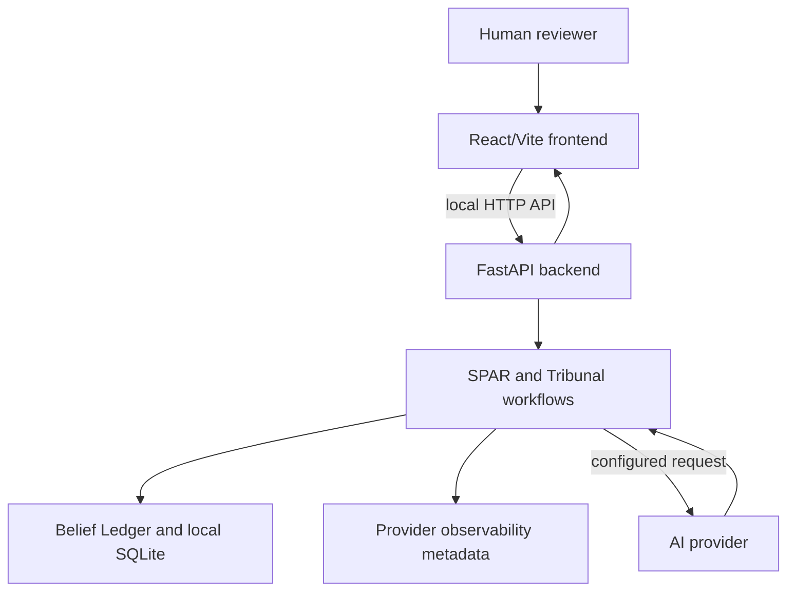

# Architecture

## Current local prototype

XOD has a browser frontend, a local FastAPI service, local SQLite persistence, and an optional configured AI provider for model-backed SPAR and Tribunal responses. The browser does not receive an API key from the application.

## Core components

| Component | Current responsibility | Boundary |
| --- | --- | --- |
| React/Vite frontend | Capture user input, display reasoning artifacts, and submit local API requests | Does not own provider credentials. |
| FastAPI backend | Validates requests, orchestrates SPAR/Tribunal, translates provider failures | Runs locally in the documented setup. |
| Belief Ledger | Persists beliefs, versions, evidence, predictions, falsification conditions, and relationships | Local SQLite data is mutable user data. |
| Provider adapter | Calls a configured model provider for model-backed flows | Provider availability and policy are outside XOD's control. |
| Provider observability | Records failure category, event ID, operation, model/provider, retryability, timestamp, and elapsed time when available | Excludes API keys, authorization headers, and prompt/response content by default. |

## Integrity boundary

The architecture supports inspectable records and human-in-the-loop reasoning. It does not guarantee that evidence is complete, claims are correct, or an AI response is trustworthy. The proposed Research Integrity Agent would require new research-specific components; see [RESEARCH_INTEGRITY_WORKFLOW.md](RESEARCH_INTEGRITY_WORKFLOW.md).

## Deliberately absent components

There is no graph visualization, autonomous confidence updater, external benchmark system, production deployment layer, specialist-agent execution engine, or Zotero integration. The first, second, third, and fourth are not implemented; specialist-agent execution and Zotero are future work.
