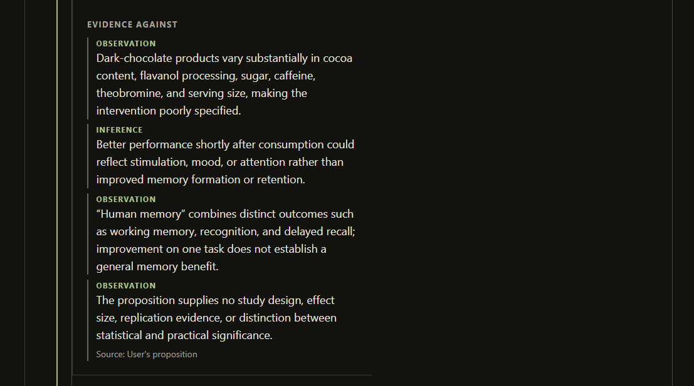
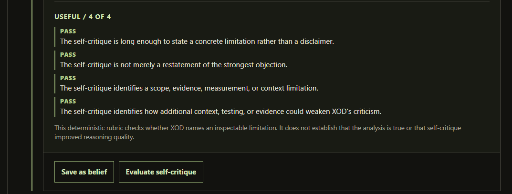
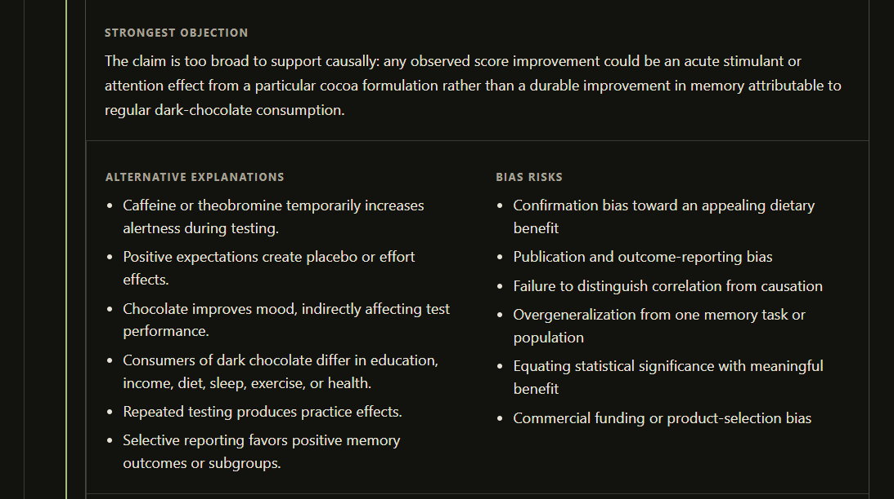
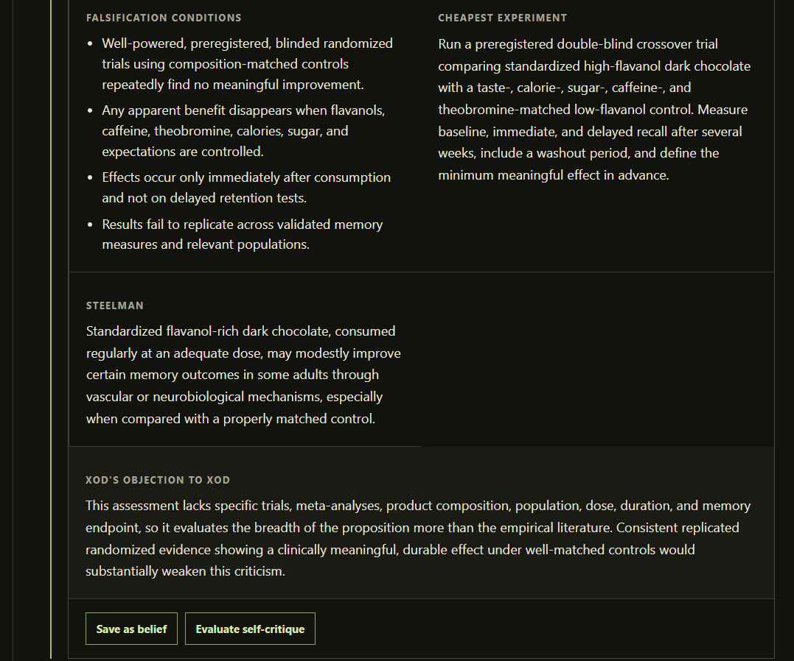

# Prototype Walkthrough

## Scope of this demonstration

Screenshots show a synthetic demonstration of the current local prototype. They are not benchmark results or scientific validation. The proposition is intentionally synthetic: “Regular consumption of dark chocolate significantly improves human memory.” The images demonstrate implemented interface behavior, not that the proposition is true or that XOD's conclusions are correct.

## Demonstrated sequence

Synthetic proposition → SPAR → Tribunal → structured adversarial evaluation → optional **Save as Belief** → persistent Belief Ledger → deterministic self-critique evaluation.

Each step is user-triggered. XOD does not autonomously initiate a second SPAR question, change the user's recorded confidence, add evidence, add predictions, retrieve external literature, or scientifically verify the proposition.

## 1. SPAR evaluation

The synthetic proposition is decomposed into a strongest assumption, strongest objection, alternative explanation, and cheapest test.

## 2. Tribunal verdict

Tribunal displays an **UNDERTESTED** verdict and a recommended confidence range for the synthetic proposition. This recommendation does not automatically modify the user's recorded confidence.

## 3. Tribunal evidence distinctions

The view separates observations from inferences and shows reasons the synthetic claim remains underdetermined. It does not represent external literature retrieval or an independent verification of the claim.

## 4. Belief Ledger

The optional Save as Belief action persists a versioned record with the proposition, the user's independently stored confidence, timestamps, and falsification conditions. It demonstrates persistence and versioned state, not autonomous belief revision.

## 5. Deterministic self-critique evaluation

The 4/4 result is a deterministic rubric result for whether XOD's self-critique contains an inspectable limitation. It is not proof that XOD's reasoning is correct.

> “This deterministic rubric checks whether XOD names an inspectable limitation. It does not establish that the analysis is true or that self-critique improved reasoning quality.”

## 6. Tribunal falsification conditions and self-critique

This lower Tribunal view shows falsification conditions, a proposed cheapest experiment, a steelman, and XOD's self-objection. It is structured adversarial evaluation of a synthetic claim, not evidence that the underlying analysis is true.

## 7. Tribunal alternatives and bias risks

The Tribunal presents alternative explanations and possible bias risks for human inspection. These interface outputs do not autonomously add evidence or conclusions to the Belief Ledger.

## 8. Self-objection action point

This capture centers the user-controlled action point after Tribunal: a reviewer may choose to save the result as a belief or request deterministic self-critique evaluation. Neither action occurs automatically, and neither control changes the user's recorded confidence silently.
